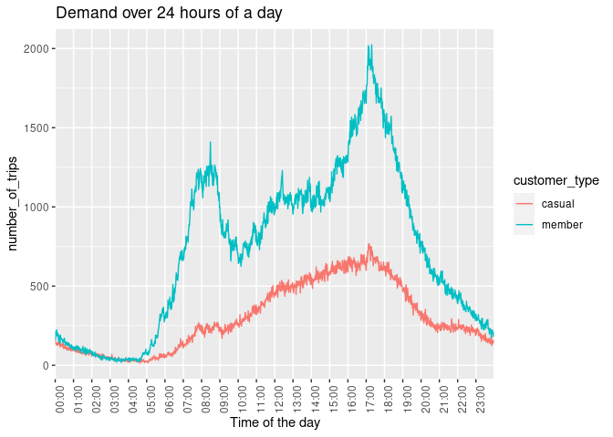

Capstone Project : Cyclistic Bikeshare
================
Krishna Mohan
2022-05-14

# Introduction

This exploratory analysis case study is towards Capstome project
requirement for [Google Data Analytics Professional
Certificate](https://www.coursera.org/professional-certificates/google-data-analytics).
The case study involves a bikeshare company’s data of its customer’s
trip details over a 6 month period (Oct21 - Apr22). The data has been
made available by Motivate International Inc. under this
[license](https://ride.divvybikes.com/data-license-agreement).

# Scenario

Marketing team needs to design marketing strategies aimed at converting
casual riders into annual members. In order to do that, however, the
marketing analyst team needs to better understand how annual members and
casual riders differ.

# Objective

Hence, my objective for this analysis is to throw some light on how the
two types of customers: annual members and casual riders, use Cyclistic
bikeshare differently, based on few parameters that can be calculated/
obtained from existing data.

# Data Sources

A total of 12 datasets have been made available for each month starting
from April 2020 to March 2021. Each dataset captures the details of
every ride logged by the customers of Cyclistic. This data that has been
made publicly available has been scrubbed to omit rider’s personal
information.

Documentation, Cleaning and Preparation of data for analysis The
combined size of all the 12 datasets is close to 1000 MB after
extracting zip file. Data cleaning in spreadsheets will be
time-consuming and slow compared to SQL or R. I am choosing R simply
because I could do both data wrangling and analysis/ visualizations in
the same platform. It is also an opportunity for me to learn R better.
Due to my system limitation I am considering only 6 months of data as my
system crashed while working with 12 months data.

# Load packages

``` r
library(dplyr)
```

    ## 
    ## Attaching package: 'dplyr'

    ## The following objects are masked from 'package:stats':
    ## 
    ##     filter, lag

    ## The following objects are masked from 'package:base':
    ## 
    ##     intersect, setdiff, setequal, union

``` r
library(ggplot2)
library(readr)
library(janitor)
```

    ## 
    ## Attaching package: 'janitor'

    ## The following objects are masked from 'package:stats':
    ## 
    ##     chisq.test, fisher.test

``` r
library(data.table)
```

    ## 
    ## Attaching package: 'data.table'

    ## The following objects are masked from 'package:dplyr':
    ## 
    ##     between, first, last

``` r
library(tidyr)
```

# Import csv data as tibble

``` r
nov21 <- as_tibble(read.csv("/home/user1/rprojects/capstonedata/202111-divvy-tripdata.csv"))
dec21 <- as_tibble(read.csv("/home/user1/rprojects/capstonedata/202112-divvy-tripdata.csv"))
jan22 <- as_tibble(read.csv("/home/user1/rprojects/capstonedata/202201-divvy-tripdata.csv"))
feb22 <- as_tibble(read.csv("/home/user1/rprojects/capstonedata/202202-divvy-tripdata.csv"))
mar22 <- as_tibble(read.csv("/home/user1/rprojects/capstonedata/202203-divvy-tripdata.csv"))
apr22 <- as_tibble(read.csv("/home/user1/rprojects/capstonedata/202204-divvy-tripdata.csv"))
```

# Check/verify data

``` r
str(nov21)
```

    ## tibble [359,978 × 13] (S3: tbl_df/tbl/data.frame)
    ##  $ ride_id           : chr [1:359978] "7C00A93E10556E47" "90854840DFD508BA" "0A7D10CDD144061C" "2F3BE33085BCFF02" ...
    ##  $ rideable_type     : chr [1:359978] "electric_bike" "electric_bike" "electric_bike" "electric_bike" ...
    ##  $ started_at        : chr [1:359978] "2021-11-27 13:27:38" "2021-11-27 13:38:25" "2021-11-26 22:03:34" "2021-11-27 09:56:49" ...
    ##  $ ended_at          : chr [1:359978] "2021-11-27 13:46:38" "2021-11-27 13:56:10" "2021-11-26 22:05:56" "2021-11-27 10:01:50" ...
    ##  $ start_station_name: chr [1:359978] "" "" "" "" ...
    ##  $ start_station_id  : chr [1:359978] "" "" "" "" ...
    ##  $ end_station_name  : chr [1:359978] "" "" "" "" ...
    ##  $ end_station_id    : chr [1:359978] "" "" "" "" ...
    ##  $ start_lat         : num [1:359978] 41.9 42 42 41.9 41.9 ...
    ##  $ start_lng         : num [1:359978] -87.7 -87.7 -87.7 -87.8 -87.6 ...
    ##  $ end_lat           : num [1:359978] 42 41.9 42 41.9 41.9 ...
    ##  $ end_lng           : num [1:359978] -87.7 -87.7 -87.7 -87.8 -87.6 ...
    ##  $ member_casual     : chr [1:359978] "casual" "casual" "casual" "casual" ...

``` r
str(dec21)
```

    ## tibble [247,540 × 13] (S3: tbl_df/tbl/data.frame)
    ##  $ ride_id           : chr [1:247540] "46F8167220E4431F" "73A77762838B32FD" "4CF42452054F59C5" "3278BA87BF698339" ...
    ##  $ rideable_type     : chr [1:247540] "electric_bike" "electric_bike" "electric_bike" "classic_bike" ...
    ##  $ started_at        : chr [1:247540] "2021-12-07 15:06:07" "2021-12-11 03:43:29" "2021-12-15 23:10:28" "2021-12-26 16:16:10" ...
    ##  $ ended_at          : chr [1:247540] "2021-12-07 15:13:42" "2021-12-11 04:10:23" "2021-12-15 23:23:14" "2021-12-26 16:30:53" ...
    ##  $ start_station_name: chr [1:247540] "Laflin St & Cullerton St" "LaSalle Dr & Huron St" "Halsted St & North Branch St" "Halsted St & North Branch St" ...
    ##  $ start_station_id  : chr [1:247540] "13307" "KP1705001026" "KA1504000117" "KA1504000117" ...
    ##  $ end_station_name  : chr [1:247540] "Morgan St & Polk St" "Clarendon Ave & Leland Ave" "Broadway & Barry Ave" "LaSalle Dr & Huron St" ...
    ##  $ end_station_id    : chr [1:247540] "TA1307000130" "TA1307000119" "13137" "KP1705001026" ...
    ##  $ start_lat         : num [1:247540] 41.9 41.9 41.9 41.9 41.9 ...
    ##  $ start_lng         : num [1:247540] -87.7 -87.6 -87.6 -87.6 -87.7 ...
    ##  $ end_lat           : num [1:247540] 41.9 42 41.9 41.9 41.9 ...
    ##  $ end_lng           : num [1:247540] -87.7 -87.7 -87.6 -87.6 -87.6 ...
    ##  $ member_casual     : chr [1:247540] "member" "casual" "member" "member" ...

``` r
str(jan22)
```

    ## tibble [103,770 × 13] (S3: tbl_df/tbl/data.frame)
    ##  $ ride_id           : chr [1:103770] "C2F7DD78E82EC875" "A6CF8980A652D272" "BD0F91DFF741C66D" "CBB80ED419105406" ...
    ##  $ rideable_type     : chr [1:103770] "electric_bike" "electric_bike" "classic_bike" "classic_bike" ...
    ##  $ started_at        : chr [1:103770] "2022-01-13 11:59:47" "2022-01-10 08:41:56" "2022-01-25 04:53:40" "2022-01-04 00:18:04" ...
    ##  $ ended_at          : chr [1:103770] "2022-01-13 12:02:44" "2022-01-10 08:46:17" "2022-01-25 04:58:01" "2022-01-04 00:33:00" ...
    ##  $ start_station_name: chr [1:103770] "Glenwood Ave & Touhy Ave" "Glenwood Ave & Touhy Ave" "Sheffield Ave & Fullerton Ave" "Clark St & Bryn Mawr Ave" ...
    ##  $ start_station_id  : chr [1:103770] "525" "525" "TA1306000016" "KA1504000151" ...
    ##  $ end_station_name  : chr [1:103770] "Clark St & Touhy Ave" "Clark St & Touhy Ave" "Greenview Ave & Fullerton Ave" "Paulina St & Montrose Ave" ...
    ##  $ end_station_id    : chr [1:103770] "RP-007" "RP-007" "TA1307000001" "TA1309000021" ...
    ##  $ start_lat         : num [1:103770] 42 42 41.9 42 41.9 ...
    ##  $ start_lng         : num [1:103770] -87.7 -87.7 -87.7 -87.7 -87.6 ...
    ##  $ end_lat           : num [1:103770] 42 42 41.9 42 41.9 ...
    ##  $ end_lng           : num [1:103770] -87.7 -87.7 -87.7 -87.7 -87.6 ...
    ##  $ member_casual     : chr [1:103770] "casual" "casual" "member" "casual" ...

``` r
str(feb22)
```

    ## tibble [115,609 × 13] (S3: tbl_df/tbl/data.frame)
    ##  $ ride_id           : chr [1:115609] "E1E065E7ED285C02" "1602DCDC5B30FFE3" "BE7DD2AF4B55C4AF" "A1789BDF844412BE" ...
    ##  $ rideable_type     : chr [1:115609] "classic_bike" "classic_bike" "classic_bike" "classic_bike" ...
    ##  $ started_at        : chr [1:115609] "2022-02-19 18:08:41" "2022-02-20 17:41:30" "2022-02-25 18:55:56" "2022-02-14 11:57:03" ...
    ##  $ ended_at          : chr [1:115609] "2022-02-19 18:23:56" "2022-02-20 17:45:56" "2022-02-25 19:09:34" "2022-02-14 12:04:00" ...
    ##  $ start_station_name: chr [1:115609] "State St & Randolph St" "Halsted St & Wrightwood Ave" "State St & Randolph St" "Southport Ave & Waveland Ave" ...
    ##  $ start_station_id  : chr [1:115609] "TA1305000029" "TA1309000061" "TA1305000029" "13235" ...
    ##  $ end_station_name  : chr [1:115609] "Clark St & Lincoln Ave" "Southport Ave & Wrightwood Ave" "Canal St & Adams St" "Broadway & Sheridan Rd" ...
    ##  $ end_station_id    : chr [1:115609] "13179" "TA1307000113" "13011" "13323" ...
    ##  $ start_lat         : num [1:115609] 41.9 41.9 41.9 41.9 41.9 ...
    ##  $ start_lng         : num [1:115609] -87.6 -87.6 -87.6 -87.7 -87.6 ...
    ##  $ end_lat           : num [1:115609] 41.9 41.9 41.9 42 41.9 ...
    ##  $ end_lng           : num [1:115609] -87.6 -87.7 -87.6 -87.6 -87.6 ...
    ##  $ member_casual     : chr [1:115609] "member" "member" "member" "member" ...

``` r
str(mar22)
```

    ## tibble [284,042 × 13] (S3: tbl_df/tbl/data.frame)
    ##  $ ride_id           : chr [1:284042] "47EC0A7F82E65D52" "8494861979B0F477" "EFE527AF80B66109" "9F446FD9DEE3F389" ...
    ##  $ rideable_type     : chr [1:284042] "classic_bike" "electric_bike" "classic_bike" "classic_bike" ...
    ##  $ started_at        : chr [1:284042] "2022-03-21 13:45:01" "2022-03-16 09:37:16" "2022-03-23 19:52:02" "2022-03-01 19:12:26" ...
    ##  $ ended_at          : chr [1:284042] "2022-03-21 13:51:18" "2022-03-16 09:43:34" "2022-03-23 19:54:48" "2022-03-01 19:22:14" ...
    ##  $ start_station_name: chr [1:284042] "Wabash Ave & Wacker Pl" "Michigan Ave & Oak St" "Broadway & Berwyn Ave" "Wabash Ave & Wacker Pl" ...
    ##  $ start_station_id  : chr [1:284042] "TA1307000131" "13042" "13109" "TA1307000131" ...
    ##  $ end_station_name  : chr [1:284042] "Kingsbury St & Kinzie St" "Orleans St & Chestnut St (NEXT Apts)" "Broadway & Ridge Ave" "Franklin St & Jackson Blvd" ...
    ##  $ end_station_id    : chr [1:284042] "KA1503000043" "620" "15578" "TA1305000025" ...
    ##  $ start_lat         : num [1:284042] 41.9 41.9 42 41.9 41.9 ...
    ##  $ start_lng         : num [1:284042] -87.6 -87.6 -87.7 -87.6 -87.6 ...
    ##  $ end_lat           : num [1:284042] 41.9 41.9 42 41.9 41.9 ...
    ##  $ end_lng           : num [1:284042] -87.6 -87.6 -87.7 -87.6 -87.7 ...
    ##  $ member_casual     : chr [1:284042] "member" "member" "member" "member" ...

``` r
str(apr22)
```

    ## tibble [371,249 × 13] (S3: tbl_df/tbl/data.frame)
    ##  $ ride_id           : chr [1:371249] "3564070EEFD12711" "0B820C7FCF22F489" "89EEEE32293F07FF" "84D4751AEB31888D" ...
    ##  $ rideable_type     : chr [1:371249] "electric_bike" "classic_bike" "classic_bike" "classic_bike" ...
    ##  $ started_at        : chr [1:371249] "2022-04-06 17:42:48" "2022-04-24 19:23:07" "2022-04-20 19:29:08" "2022-04-22 21:14:06" ...
    ##  $ ended_at          : chr [1:371249] "2022-04-06 17:54:36" "2022-04-24 19:43:17" "2022-04-20 19:35:16" "2022-04-22 21:23:29" ...
    ##  $ start_station_name: chr [1:371249] "Paulina St & Howard St" "Wentworth Ave & Cermak Rd" "Halsted St & Polk St" "Wentworth Ave & Cermak Rd" ...
    ##  $ start_station_id  : chr [1:371249] "515" "13075" "TA1307000121" "13075" ...
    ##  $ end_station_name  : chr [1:371249] "University Library (NU)" "Green St & Madison St" "Green St & Madison St" "Delano Ct & Roosevelt Rd" ...
    ##  $ end_station_id    : chr [1:371249] "605" "TA1307000120" "TA1307000120" "KA1706005007" ...
    ##  $ start_lat         : num [1:371249] 42 41.9 41.9 41.9 41.9 ...
    ##  $ start_lng         : num [1:371249] -87.7 -87.6 -87.6 -87.6 -87.6 ...
    ##  $ end_lat           : num [1:371249] 42.1 41.9 41.9 41.9 41.9 ...
    ##  $ end_lng           : num [1:371249] -87.7 -87.6 -87.6 -87.6 -87.6 ...
    ##  $ member_casual     : chr [1:371249] "member" "member" "member" "casual" ...

``` r
glimpse(nov21)
```

    ## Rows: 359,978
    ## Columns: 13
    ## $ ride_id            <chr> "7C00A93E10556E47", "90854840DFD508BA", "0A7D10CDD1…
    ## $ rideable_type      <chr> "electric_bike", "electric_bike", "electric_bike", …
    ## $ started_at         <chr> "2021-11-27 13:27:38", "2021-11-27 13:38:25", "2021…
    ## $ ended_at           <chr> "2021-11-27 13:46:38", "2021-11-27 13:56:10", "2021…
    ## $ start_station_name <chr> "", "", "", "", "", "Michigan Ave & Oak St", "", ""…
    ## $ start_station_id   <chr> "", "", "", "", "", "13042", "", "", "", "", "", ""…
    ## $ end_station_name   <chr> "", "", "", "", "", "", "", "", "", "", "", "", "",…
    ## $ end_station_id     <chr> "", "", "", "", "", "", "", "", "", "", "", "", "",…
    ## $ start_lat          <dbl> 41.93000, 41.96000, 41.96000, 41.94000, 41.90000, 4…
    ## $ start_lng          <dbl> -87.72000, -87.70000, -87.70000, -87.79000, -87.630…
    ## $ end_lat            <dbl> 41.96, 41.92, 41.96, 41.93, 41.88, 41.90, 41.80, 41…
    ## $ end_lng            <dbl> -87.73, -87.70, -87.70, -87.79, -87.62, -87.63, -87…
    ## $ member_casual      <chr> "casual", "casual", "casual", "casual", "casual", "…

``` r
glimpse(dec21)
```

    ## Rows: 247,540
    ## Columns: 13
    ## $ ride_id            <chr> "46F8167220E4431F", "73A77762838B32FD", "4CF4245205…
    ## $ rideable_type      <chr> "electric_bike", "electric_bike", "electric_bike", …
    ## $ started_at         <chr> "2021-12-07 15:06:07", "2021-12-11 03:43:29", "2021…
    ## $ ended_at           <chr> "2021-12-07 15:13:42", "2021-12-11 04:10:23", "2021…
    ## $ start_station_name <chr> "Laflin St & Cullerton St", "LaSalle Dr & Huron St"…
    ## $ start_station_id   <chr> "13307", "KP1705001026", "KA1504000117", "KA1504000…
    ## $ end_station_name   <chr> "Morgan St & Polk St", "Clarendon Ave & Leland Ave"…
    ## $ end_station_id     <chr> "TA1307000130", "TA1307000119", "13137", "KP1705001…
    ## $ start_lat          <dbl> 41.85483, 41.89441, 41.89936, 41.89939, 41.89558, 4…
    ## $ start_lng          <dbl> -87.66366, -87.63233, -87.64852, -87.64854, -87.682…
    ## $ end_lat            <dbl> 41.87197, 41.96797, 41.93758, 41.89488, 41.93125, 4…
    ## $ end_lng            <dbl> -87.65097, -87.65000, -87.64410, -87.63233, -87.644…
    ## $ member_casual      <chr> "member", "casual", "member", "member", "member", "…

``` r
glimpse(jan22)
```

    ## Rows: 103,770
    ## Columns: 13
    ## $ ride_id            <chr> "C2F7DD78E82EC875", "A6CF8980A652D272", "BD0F91DFF7…
    ## $ rideable_type      <chr> "electric_bike", "electric_bike", "classic_bike", "…
    ## $ started_at         <chr> "2022-01-13 11:59:47", "2022-01-10 08:41:56", "2022…
    ## $ ended_at           <chr> "2022-01-13 12:02:44", "2022-01-10 08:46:17", "2022…
    ## $ start_station_name <chr> "Glenwood Ave & Touhy Ave", "Glenwood Ave & Touhy A…
    ## $ start_station_id   <chr> "525", "525", "TA1306000016", "KA1504000151", "TA13…
    ## $ end_station_name   <chr> "Clark St & Touhy Ave", "Clark St & Touhy Ave", "Gr…
    ## $ end_station_id     <chr> "RP-007", "RP-007", "TA1307000001", "TA1309000021",…
    ## $ start_lat          <dbl> 42.01280, 42.01276, 41.92560, 41.98359, 41.87785, 4…
    ## $ start_lng          <dbl> -87.66591, -87.66597, -87.65371, -87.66915, -87.624…
    ## $ end_lat            <dbl> 42.01256, 42.01256, 41.92533, 41.96151, 41.88462, 4…
    ## $ end_lng            <dbl> -87.67437, -87.67437, -87.66580, -87.67139, -87.627…
    ## $ member_casual      <chr> "casual", "casual", "member", "casual", "member", "…

``` r
glimpse(feb22)
```

    ## Rows: 115,609
    ## Columns: 13
    ## $ ride_id            <chr> "E1E065E7ED285C02", "1602DCDC5B30FFE3", "BE7DD2AF4B…
    ## $ rideable_type      <chr> "classic_bike", "classic_bike", "classic_bike", "cl…
    ## $ started_at         <chr> "2022-02-19 18:08:41", "2022-02-20 17:41:30", "2022…
    ## $ ended_at           <chr> "2022-02-19 18:23:56", "2022-02-20 17:45:56", "2022…
    ## $ start_station_name <chr> "State St & Randolph St", "Halsted St & Wrightwood …
    ## $ start_station_id   <chr> "TA1305000029", "TA1309000061", "TA1305000029", "13…
    ## $ end_station_name   <chr> "Clark St & Lincoln Ave", "Southport Ave & Wrightwo…
    ## $ end_station_id     <chr> "13179", "TA1307000113", "13011", "13323", "TA13070…
    ## $ start_lat          <dbl> 41.88462, 41.92914, 41.88462, 41.94815, 41.88462, 4…
    ## $ start_lng          <dbl> -87.62783, -87.64908, -87.62783, -87.66394, -87.627…
    ## $ end_lat            <dbl> 41.91569, 41.92877, 41.87926, 41.95283, 41.88584, 4…
    ## $ end_lng            <dbl> -87.63460, -87.66391, -87.63990, -87.64999, -87.635…
    ## $ member_casual      <chr> "member", "member", "member", "member", "member", "…

``` r
glimpse(mar22)
```

    ## Rows: 284,042
    ## Columns: 13
    ## $ ride_id            <chr> "47EC0A7F82E65D52", "8494861979B0F477", "EFE527AF80…
    ## $ rideable_type      <chr> "classic_bike", "electric_bike", "classic_bike", "c…
    ## $ started_at         <chr> "2022-03-21 13:45:01", "2022-03-16 09:37:16", "2022…
    ## $ ended_at           <chr> "2022-03-21 13:51:18", "2022-03-16 09:43:34", "2022…
    ## $ start_station_name <chr> "Wabash Ave & Wacker Pl", "Michigan Ave & Oak St", …
    ## $ start_station_id   <chr> "TA1307000131", "13042", "13109", "TA1307000131", "…
    ## $ end_station_name   <chr> "Kingsbury St & Kinzie St", "Orleans St & Chestnut …
    ## $ end_station_id     <chr> "KA1503000043", "620", "15578", "TA1305000025", "13…
    ## $ start_lat          <dbl> 41.88688, 41.90100, 41.97835, 41.88688, 41.91172, 4…
    ## $ start_lng          <dbl> -87.62603, -87.62375, -87.65975, -87.62603, -87.626…
    ## $ end_lat            <dbl> 41.88918, 41.89820, 41.98404, 41.87771, 41.87794, 4…
    ## $ end_lng            <dbl> -87.63851, -87.63754, -87.66027, -87.63532, -87.662…
    ## $ member_casual      <chr> "member", "member", "member", "member", "member", "…

``` r
glimpse(apr22)
```

    ## Rows: 371,249
    ## Columns: 13
    ## $ ride_id            <chr> "3564070EEFD12711", "0B820C7FCF22F489", "89EEEE3229…
    ## $ rideable_type      <chr> "electric_bike", "classic_bike", "classic_bike", "c…
    ## $ started_at         <chr> "2022-04-06 17:42:48", "2022-04-24 19:23:07", "2022…
    ## $ ended_at           <chr> "2022-04-06 17:54:36", "2022-04-24 19:43:17", "2022…
    ## $ start_station_name <chr> "Paulina St & Howard St", "Wentworth Ave & Cermak R…
    ## $ start_station_id   <chr> "515", "13075", "TA1307000121", "13075", "TA1307000…
    ## $ end_station_name   <chr> "University Library (NU)", "Green St & Madison St",…
    ## $ end_station_id     <chr> "605", "TA1307000120", "TA1307000120", "KA170600500…
    ## $ start_lat          <dbl> 42.01913, 41.85308, 41.87184, 41.85308, 41.87181, 4…
    ## $ start_lng          <dbl> -87.67353, -87.63193, -87.64664, -87.63193, -87.646…
    ## $ end_lat            <dbl> 42.05294, 41.88189, 41.88189, 41.86749, 41.88224, 4…
    ## $ end_lng            <dbl> -87.67345, -87.64879, -87.64879, -87.63219, -87.641…
    ## $ member_casual      <chr> "member", "member", "member", "casual", "member", "…

# Combining the data into one frame

``` r
nov2apr22 <- bind_rows(nov21, dec21, jan22, feb22, mar22, apr22)

str(nov2apr22)
```

    ## tibble [1,482,188 × 13] (S3: tbl_df/tbl/data.frame)
    ##  $ ride_id           : chr [1:1482188] "7C00A93E10556E47" "90854840DFD508BA" "0A7D10CDD144061C" "2F3BE33085BCFF02" ...
    ##  $ rideable_type     : chr [1:1482188] "electric_bike" "electric_bike" "electric_bike" "electric_bike" ...
    ##  $ started_at        : chr [1:1482188] "2021-11-27 13:27:38" "2021-11-27 13:38:25" "2021-11-26 22:03:34" "2021-11-27 09:56:49" ...
    ##  $ ended_at          : chr [1:1482188] "2021-11-27 13:46:38" "2021-11-27 13:56:10" "2021-11-26 22:05:56" "2021-11-27 10:01:50" ...
    ##  $ start_station_name: chr [1:1482188] "" "" "" "" ...
    ##  $ start_station_id  : chr [1:1482188] "" "" "" "" ...
    ##  $ end_station_name  : chr [1:1482188] "" "" "" "" ...
    ##  $ end_station_id    : chr [1:1482188] "" "" "" "" ...
    ##  $ start_lat         : num [1:1482188] 41.9 42 42 41.9 41.9 ...
    ##  $ start_lng         : num [1:1482188] -87.7 -87.7 -87.7 -87.8 -87.6 ...
    ##  $ end_lat           : num [1:1482188] 42 41.9 42 41.9 41.9 ...
    ##  $ end_lng           : num [1:1482188] -87.7 -87.7 -87.7 -87.8 -87.6 ...
    ##  $ member_casual     : chr [1:1482188] "casual" "casual" "casual" "casual" ...

``` r
glimpse(nov2apr22)
```

    ## Rows: 1,482,188
    ## Columns: 13
    ## $ ride_id            <chr> "7C00A93E10556E47", "90854840DFD508BA", "0A7D10CDD1…
    ## $ rideable_type      <chr> "electric_bike", "electric_bike", "electric_bike", …
    ## $ started_at         <chr> "2021-11-27 13:27:38", "2021-11-27 13:38:25", "2021…
    ## $ ended_at           <chr> "2021-11-27 13:46:38", "2021-11-27 13:56:10", "2021…
    ## $ start_station_name <chr> "", "", "", "", "", "Michigan Ave & Oak St", "", ""…
    ## $ start_station_id   <chr> "", "", "", "", "", "13042", "", "", "", "", "", ""…
    ## $ end_station_name   <chr> "", "", "", "", "", "", "", "", "", "", "", "", "",…
    ## $ end_station_id     <chr> "", "", "", "", "", "", "", "", "", "", "", "", "",…
    ## $ start_lat          <dbl> 41.93000, 41.96000, 41.96000, 41.94000, 41.90000, 4…
    ## $ start_lng          <dbl> -87.72000, -87.70000, -87.70000, -87.79000, -87.630…
    ## $ end_lat            <dbl> 41.96, 41.92, 41.96, 41.93, 41.88, 41.90, 41.80, 41…
    ## $ end_lng            <dbl> -87.73, -87.70, -87.70, -87.79, -87.62, -87.63, -87…
    ## $ member_casual      <chr> "casual", "casual", "casual", "casual", "casual", "…

# Remove columns not required from start_lat uptill end_lng

``` r
nov2apr22 <- nov2apr22 %>%
  select(-c(start_lat:end_lng))

glimpse(nov2apr22)
```

    ## Rows: 1,482,188
    ## Columns: 9
    ## $ ride_id            <chr> "7C00A93E10556E47", "90854840DFD508BA", "0A7D10CDD1…
    ## $ rideable_type      <chr> "electric_bike", "electric_bike", "electric_bike", …
    ## $ started_at         <chr> "2021-11-27 13:27:38", "2021-11-27 13:38:25", "2021…
    ## $ ended_at           <chr> "2021-11-27 13:46:38", "2021-11-27 13:56:10", "2021…
    ## $ start_station_name <chr> "", "", "", "", "", "Michigan Ave & Oak St", "", ""…
    ## $ start_station_id   <chr> "", "", "", "", "", "13042", "", "", "", "", "", ""…
    ## $ end_station_name   <chr> "", "", "", "", "", "", "", "", "", "", "", "", "",…
    ## $ end_station_id     <chr> "", "", "", "", "", "", "", "", "", "", "", "", "",…
    ## $ member_casual      <chr> "casual", "casual", "casual", "casual", "casual", "…

# Save as csv for further use: optional

``` r
write.csv(nov2apr22, "/home/user1/rprojects/capstone_13052022/capstone_try1/quarterlydata/nov2apr22.csv")
```

# Convert data types

started_at & ended_at as datetime

``` r
library(lubridate)
```

    ## 
    ## Attaching package: 'lubridate'

    ## The following objects are masked from 'package:data.table':
    ## 
    ##     hour, isoweek, mday, minute, month, quarter, second, wday, week,
    ##     yday, year

    ## The following objects are masked from 'package:base':
    ## 
    ##     date, intersect, setdiff, union

``` r
nov2apr22[["started_at"]] <- as.POSIXct(nov2apr22[["started_at"]], format = "%Y-%m-%d %H:%M:%S")
nov2apr22[["ended_at"]] <- as.POSIXct(nov2apr22[["ended_at"]], format = "%Y-%m-%d %H:%M:%S")

glimpse(nov2apr22)
```

    ## Rows: 1,482,188
    ## Columns: 9
    ## $ ride_id            <chr> "7C00A93E10556E47", "90854840DFD508BA", "0A7D10CDD1…
    ## $ rideable_type      <chr> "electric_bike", "electric_bike", "electric_bike", …
    ## $ started_at         <dttm> 2021-11-27 13:27:38, 2021-11-27 13:38:25, 2021-11-…
    ## $ ended_at           <dttm> 2021-11-27 13:46:38, 2021-11-27 13:56:10, 2021-11-…
    ## $ start_station_name <chr> "", "", "", "", "", "Michigan Ave & Oak St", "", ""…
    ## $ start_station_id   <chr> "", "", "", "", "", "13042", "", "", "", "", "", ""…
    ## $ end_station_name   <chr> "", "", "", "", "", "", "", "", "", "", "", "", "",…
    ## $ end_station_id     <chr> "", "", "", "", "", "", "", "", "", "", "", "", "",…
    ## $ member_casual      <chr> "casual", "casual", "casual", "casual", "casual", "…

# Rename columns for readabality

``` r
nov2apr22 <- nov2apr22 %>%
  rename(ride_type = rideable_type, 
         start_time = started_at,
         end_time = ended_at,
         customer_type = member_casual)

glimpse(nov2apr22)
```

    ## Rows: 1,482,188
    ## Columns: 9
    ## $ ride_id            <chr> "7C00A93E10556E47", "90854840DFD508BA", "0A7D10CDD1…
    ## $ ride_type          <chr> "electric_bike", "electric_bike", "electric_bike", …
    ## $ start_time         <dttm> 2021-11-27 13:27:38, 2021-11-27 13:38:25, 2021-11-…
    ## $ end_time           <dttm> 2021-11-27 13:46:38, 2021-11-27 13:56:10, 2021-11-…
    ## $ start_station_name <chr> "", "", "", "", "", "Michigan Ave & Oak St", "", ""…
    ## $ start_station_id   <chr> "", "", "", "", "", "13042", "", "", "", "", "", ""…
    ## $ end_station_name   <chr> "", "", "", "", "", "", "", "", "", "", "", "", "",…
    ## $ end_station_id     <chr> "", "", "", "", "", "", "", "", "", "", "", "", "",…
    ## $ customer_type      <chr> "casual", "casual", "casual", "casual", "casual", "…

# Add new columns that can be used for aggregate functions

``` r
nov2apr22$day_of_the_week <- format(as.Date(nov2apr22$start_time),'%a')
```

# Column for month when the trip started

``` r
nov2apr22$month <- format(as.Date(nov2apr22$start_time),'%b_%y')
```

# Column for time of the day when the trip started

Time element needs to be extracted from start_time. However, as the
times must be in POSIXct(only times of class POSIXct are supported in
ggplot2), a two-step conversion is needed. First the time is converted
to a character vector, effectively stripping all the date information.
The time is then converted back to POSIXct with today’s date – the date
is of no interest to us, only the hours-minutes-seconds are.

``` r
nov2apr22$time <- format(nov2apr22$start_time, format = "%H:%M")

nov2apr22$time <- as.POSIXct(nov2apr22$time, format = "%H:%M")
```

# Column for trip_duration in min

``` r
nov2apr22$trip_duration <- (as.double(difftime(nov2apr22$end_time, nov2apr22$start_time)))/60
```

## Check & verify

``` r
glimpse(nov2apr22)
```

    ## Rows: 1,482,188
    ## Columns: 13
    ## $ ride_id            <chr> "7C00A93E10556E47", "90854840DFD508BA", "0A7D10CDD1…
    ## $ ride_type          <chr> "electric_bike", "electric_bike", "electric_bike", …
    ## $ start_time         <dttm> 2021-11-27 13:27:38, 2021-11-27 13:38:25, 2021-11-…
    ## $ end_time           <dttm> 2021-11-27 13:46:38, 2021-11-27 13:56:10, 2021-11-…
    ## $ start_station_name <chr> "", "", "", "", "", "Michigan Ave & Oak St", "", ""…
    ## $ start_station_id   <chr> "", "", "", "", "", "13042", "", "", "", "", "", ""…
    ## $ end_station_name   <chr> "", "", "", "", "", "", "", "", "", "", "", "", "",…
    ## $ end_station_id     <chr> "", "", "", "", "", "", "", "", "", "", "", "", "",…
    ## $ customer_type      <chr> "casual", "casual", "casual", "casual", "casual", "…
    ## $ day_of_the_week    <chr> "Sat", "Sat", "Fri", "Sat", "Fri", "Fri", "Sat", "S…
    ## $ month              <chr> "Nov_21", "Nov_21", "Nov_21", "Nov_21", "Nov_21", "…
    ## $ time               <dttm> 2022-05-14 13:27:00, 2022-05-14 13:38:00, 2022-05-…
    ## $ trip_duration      <dbl> 19.000000, 17.750000, 2.366667, 5.016667, 21.216667…

# Checking for trip lengths less than 0 minutes

``` r
nrow(subset(nov2apr22,trip_duration < 0))
```

    ## [1] 55

# Checking for testrides that were made by company for quality checks

``` r
nrow(subset(nov2apr22, start_station_name %like% "TEST"))
```

    ## [1] 0

``` r
nrow(subset(nov2apr22, start_station_name %like% "test"))
```

    ## [1] 0

``` r
nrow(subset(nov2apr22, start_station_name %like% "Test"))
```

    ## [1] 1

# Remove negative trip durations

``` r
nov2apr22v2 <- nov2apr22[!(nov2apr22$trip_duration < 0),]
```

# Remove test rides

As it must not be counted

``` r
nov2apr22v2<- nov2apr22v2[!((nov2apr22v2$start_station_name %like% "TEST" | nov2apr22v2$start_station_name %like% "test")),]
```

## Check & Verify

``` r
glimpse(nov2apr22v2)
```

    ## Rows: 1,482,133
    ## Columns: 13
    ## $ ride_id            <chr> "7C00A93E10556E47", "90854840DFD508BA", "0A7D10CDD1…
    ## $ ride_type          <chr> "electric_bike", "electric_bike", "electric_bike", …
    ## $ start_time         <dttm> 2021-11-27 13:27:38, 2021-11-27 13:38:25, 2021-11-…
    ## $ end_time           <dttm> 2021-11-27 13:46:38, 2021-11-27 13:56:10, 2021-11-…
    ## $ start_station_name <chr> "", "", "", "", "", "Michigan Ave & Oak St", "", ""…
    ## $ start_station_id   <chr> "", "", "", "", "", "13042", "", "", "", "", "", ""…
    ## $ end_station_name   <chr> "", "", "", "", "", "", "", "", "", "", "", "", "",…
    ## $ end_station_id     <chr> "", "", "", "", "", "", "", "", "", "", "", "", "",…
    ## $ customer_type      <chr> "casual", "casual", "casual", "casual", "casual", "…
    ## $ day_of_the_week    <chr> "Sat", "Sat", "Fri", "Sat", "Fri", "Fri", "Sat", "S…
    ## $ month              <chr> "Nov_21", "Nov_21", "Nov_21", "Nov_21", "Nov_21", "…
    ## $ time               <dttm> 2022-05-14 13:27:00, 2022-05-14 13:38:00, 2022-05-…
    ## $ trip_duration      <dbl> 19.000000, 17.750000, 2.366667, 5.016667, 21.216667…

# Checking count of distinct values

It is important to make sure that customer_type column has only two
distinct values. Let’s confirm the same.

``` r
table(nov2apr22v2$customer_type)
```

    ## 
    ##  casual  member 
    ##  432869 1049264

# Aggregating total trip duration by customer type

``` r
setNames(aggregate(trip_duration ~ customer_type, nov2apr22v2, sum), c("customer_type", "total_trip_duration(mins)"))
```

    ##   customer_type total_trip_duration(mins)
    ## 1        casual                  11911409
    ## 2        member                  12049532

# Analyze and Visualize the Data

The dataframe is now ready for descriptive analysis that will help us
uncover some insights on how the casual riders and members use Cyclistic
rideshare differently. First, let’s try to get some simple statistics on
trip_duration for all customers, and do the same by customer_type. \##
statictical summary of trip_duration for all trips

``` r
summary(nov2apr22v2$trip_duration)
```

    ##     Min.  1st Qu.   Median     Mean  3rd Qu.     Max. 
    ##     0.00     5.10     8.82    16.17    15.82 34997.72

## statistical summary of trip_duration by customer_type

``` r
nov2apr22v2 %>%
  group_by(customer_type) %>%
  summarise(min_trip_duration = min(trip_duration),max_trip_duration = max(trip_duration),
            median_trip_duration = median(trip_duration), mean_trip_duration = mean(trip_duration))
```

    ## # A tibble: 2 × 5
    ##   customer_type min_trip_duration max_trip_duration median_trip_duration
    ##   <chr>                     <dbl>             <dbl>                <dbl>
    ## 1 casual                        0            34998.                12.4 
    ## 2 member                        0             1560.                 7.75
    ## # … with 1 more variable: mean_trip_duration <dbl>

The mean trip duration of member riders is lower than the mean trip
duration of all trips, while it is exactly the opposite for casual
riders, This tells us that casual riders usually take the bikes out for
a longer duration compared to members. Total number of trips by customer
type and day of the week

Fix the order for the day_of_the_week and month variable so that they
show up in the same sequence in output tables and visualizations

``` r
nov2apr22v2$day_of_the_week <- ordered(nov2apr22v2$day_of_the_week, levels=c("Mon", "Tue", "Wed", "Thu", "Fri", "Sat", "Sun"))

nov2apr22v2$month <- ordered(nov2apr22v2$month, levels=c("Nov_21", "Dec_21", "Jan_22", "Feb_22", "Mar_22", "Apr_22"))
```

``` r
nov2apr22v2 %>% 
  group_by(customer_type, day_of_the_week) %>%  
  summarise(number_of_rides = n(),average_duration_mins = mean(trip_duration)) %>% 
  arrange(customer_type, desc(number_of_rides))
```

    ## `summarise()` has grouped output by 'customer_type'. You can override using the
    ## `.groups` argument.

    ## # A tibble: 14 × 4
    ## # Groups:   customer_type [2]
    ##    customer_type day_of_the_week number_of_rides average_duration_mins
    ##    <chr>         <ord>                     <int>                 <dbl>
    ##  1 casual        Sat                       90099                  32.2
    ##  2 casual        Sun                       64147                  33.1
    ##  3 casual        Fri                       58006                  24.0
    ##  4 casual        Thu                       57508                  25.5
    ##  5 casual        Mon                       55778                  27.6
    ##  6 casual        Wed                       54910                  24.0
    ##  7 casual        Tue                       52421                  22.3
    ##  8 member        Tue                      178247                  11.0
    ##  9 member        Wed                      169287                  11.0
    ## 10 member        Thu                      163614                  11.0
    ## 11 member        Mon                      162901                  11.4
    ## 12 member        Fri                      142014                  11.2
    ## 13 member        Sat                      126636                  12.9
    ## 14 member        Sun                      106565                  12.7

## Visualization : Total trips by customer type Vs. Day of the week

``` r
nov2apr22v2 %>%  
  group_by(customer_type, day_of_the_week) %>% 
  summarise(number_of_rides = n()) %>% 
  arrange(customer_type, day_of_the_week)  %>% 
  ggplot(aes(x = day_of_the_week, y = number_of_rides, fill = customer_type)) +
  labs(title ="Total trips by customer type Vs. Day of the week") +
  geom_col(width=0.5, position = position_dodge(width=0.5)) +
  scale_y_continuous(labels = function(x) format(x, scientific = FALSE))
```

    ## `summarise()` has grouped output by 'customer_type'. You can override using the
    ## `.groups` argument.

<!-- --> From the
graph, causal customers are most busy on sat then sundays, while members
are most busy on tue then wed, mon & thu. Causal riders most busy on
weekends & members on tuesdays

# Average number of trips by customer type and month

``` r
nov2apr22 %>% 
  group_by(customer_type, month) %>%  
  summarise(number_of_rides = n(),`average_duration_(mins)` = mean(trip_duration)) %>% 
  arrange(customer_type,desc(number_of_rides))
```

    ## `summarise()` has grouped output by 'customer_type'. You can override using the
    ## `.groups` argument.

    ## # A tibble: 14 × 4
    ## # Groups:   customer_type [2]
    ##    customer_type month  number_of_rides `average_duration_(mins)`
    ##    <chr>         <chr>            <int>                     <dbl>
    ##  1 casual        Apr_22          126338                     29.5 
    ##  2 casual        Nov_21          106812                     23.1 
    ##  3 casual        Mar_22           89902                     32.6 
    ##  4 casual        Dec_21           70211                     24.3 
    ##  5 casual        Feb_22           21454                     26.7 
    ##  6 casual        Jan_22           17992                     27.7 
    ##  7 casual        Oct_21             193                     13.8 
    ##  8 member        Nov_21          252980                     11.3 
    ##  9 member        Apr_22          244709                     11.5 
    ## 10 member        Mar_22          194197                     11.9 
    ## 11 member        Dec_21          178015                     11.0 
    ## 12 member        Feb_22           94203                     11.4 
    ## 13 member        Jan_22           84940                     12.0 
    ## 14 member        Oct_21             242                      9.93

## Visualization: Total trips by customer type Vs. Month

``` r
nov2apr22 %>%  
  group_by(customer_type, month) %>% 
  summarise(number_of_rides = n()) %>% 
  arrange(customer_type, month)  %>% 
  ggplot(aes(x = month, y = number_of_rides, fill = customer_type)) +
  labs(title ="Total trips by customer type Vs. Month") +
  theme(axis.text.x = element_text(angle = 30)) +
  geom_col(width=0.5, position = position_dodge(width=0.5)) +
  scale_y_continuous(labels = function(x) format(x, scientific = FALSE))
```

    ## `summarise()` has grouped output by 'customer_type'. You can override using the
    ## `.groups` argument.

<!-- -->

Here as per plot nov21 is most busy for members followed by apr22 then
mar22. causal riders are most busy during apr22 followed by nov21 &
mar22. jan & feb22 having least riders of both types

# Visualizaton: Average trip duration by customer type Vs. Day of the week

``` r
nov2apr22v2 %>%  
  group_by(customer_type, day_of_the_week) %>% 
  summarise(average_trip_duration = mean(trip_duration)) %>%
  ggplot(aes(x = day_of_the_week, y = average_trip_duration, fill = customer_type)) +
  geom_col(width=0.5, position = position_dodge(width=0.5)) + 
  labs(title ="Average trip duration by customer type Vs. Day of the week")
```

    ## `summarise()` has grouped output by 'customer_type'. You can override using the
    ## `.groups` argument.

<!-- --> The average
trip duration of a casual rider is more than twice that of a member.
Note that this necessarily does not mean that casual riders travel
farther distance. It is also interesting to note that weekends not only
contribute to more number of trips but also longer trips on average when
compared to weekdays.

# Visualizaton of average trip duration by customer type Vs. month

``` r
nov2apr22 %>%  
  group_by(customer_type, month) %>% 
  summarise(average_trip_duration = mean(trip_duration)) %>%
  ggplot(aes(x = month, y = average_trip_duration, fill = customer_type)) +
  geom_col(width=0.5, position = position_dodge(width=0.5)) + 
  labs(title ="Average trip duration by customer type Vs. Month") +
  theme(axis.text.x = element_text(angle = 30))
```

    ## `summarise()` has grouped output by 'customer_type'. You can override using the
    ## `.groups` argument.

<!-- --> Average trip
duration of member riders is aproxx 10 minutes throughout the duration,
However, there seems to be a distinct pattern when it comes to casual
riders, whose average trip duration swings wildly from as low as \~12
minutes to more 30 min depending on time of the year. It is worth noting
unusually long trip durations by casual riders in the month of march22.

# Visualizaton of bike demand over 24 hr period (a day)

``` r
nov2apr22v2 %>%  
  group_by(customer_type, time) %>% 
  summarise(number_of_trips = n()) %>%
  ggplot(aes(x = time, y = number_of_trips, color = customer_type, group = customer_type)) +
  geom_line() +
  scale_x_datetime(date_breaks = "1 hour", minor_breaks = NULL,
                   date_labels = "%H:%M", expand = c(0,0)) +
  theme(axis.text.x = element_text(angle = 90)) +
  labs(title ="Demand over 24 hours of a day", x = "Time of the day")
```

    ## `summarise()` has grouped output by 'customer_type'. You can override using the
    ## `.groups` argument.

<!-- --> For the
members, there seems to be two distict peak demand hours: 7-9 AM and 5-6
PM. Probably because office-goers make up majority of the members
profile due to demand in both morning and evening hours, but we need
more data to substabtiate this assumption.

# Visualizaton of ride type Vs. number of trips by customer type

``` r
nov2apr22v2 %>%
  group_by(ride_type, customer_type) %>%
  summarise(number_of_trips = n()) %>%  
  ggplot(aes(x= ride_type, y=number_of_trips, fill= customer_type))+
  geom_bar(stat='identity') +
  scale_y_continuous(labels = function(x) format(x, scientific = FALSE)) +
  labs(title ="Ride type Vs. Number of trips")
```

    ## `summarise()` has grouped output by 'ride_type'. You can override using the
    ## `.groups` argument.

<!-- -->

Both classic & electric bikes are used by members, while docked only by
causal It is surprising that docked bikes are only used by causal
members.

# Creating a csv file for further use

Exporting the clean data for futher analysis or visualizations in other
tools like SQL, Tableau, Power BI, etc.

``` r
clean_data <- aggregate(nov2apr22v2$trip_duration ~ nov2apr22v2$customer_type + nov2apr22v2$day_of_the_week, FUN = mean)

write.csv(clean_data, "Clean Data.csv", row.names = F)
```

# Key Takeaways

There is very slight difference between the trip duration(in minutes)
between causal & member riders. Members are riding 50.288% of total
minutes, while causal riders rides 49.712% of total minutes rided.

The mean trip duration of member riders is lower than the mean trip
duration of all trips, while it is exactly the opposite for casual
riders, This tells us that casual riders usually take the bikes out for
a longer duration compared to members.

Causal customers are most busy on sat then Sundays, while members are
most busy on tue then wed, Mon & thu. Causal riders most busy on
weekends & members on Tuesdays

Nov21 is most busy for members followed by apr22 then mar22. causal
riders are most busy during apr22 followed by nov21 & mar22. jan & feb22
having least riders of both types

The average trip duration of a casual rider is more than twice that of a
member. Note that this necessarily does not mean that casual riders
travel farther distance. It is also interesting to note that weekends
not only contribute to more number of trips but also longer trips on
average when compared to weekdays.

Average trip duration of member riders is aproxx 10 minutes throughout
the duration, However, there seems to be a distinct pattern when it
comes to casual riders, whose average trip duration swings wildly from
as low as \~12 minutes to more 30 min depending on time of the year. It
is worth noting unusually long trip durations by casual riders in the
month of march22.

For the members, there seems to be two distict peak demand hours: 7-9 AM
and 5-6 PM. Probably because office-goers make up majority of the
members profile due to demand in both morning and evening hours, but we
need more data to substabtiate this assumption.

Both classic & electric bikes are used by members, while docked only by
causal It is surprising that docked bikes are only used by causal
members.

# Recommendations

Discounted pricing during not so busy hours of day, may result into more
ride by causal riders, hence increase in demand.

Membership discount fees if renewal done after next payment cycle, might
result in making casual riders as members.

Promotional offers during weekdays to increase engagement of causal
riders.
